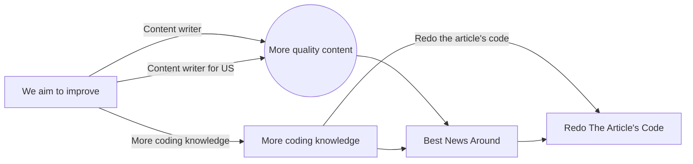

# LocalTechnews
LocalTechnews is a web service that brings you up-to-date tech news, allowing users to contribute articles, add comments, and participate in discussions. The platform is designed for tech enthusiasts, journalists, and developers who want to stay informed and share knowledge.

## Acknowledgements
We extend our deepest gratitude to everyone who has supported the LocalTechnews project. Your ideas, suggestions, and hard work have made this platform a reality, and your contributions have helped shape LocalTechnews into what it is today.

Special thanks to:
- Our community for continuous support and feedback.
- Our development team for their relentless work.
- All contributors who have shared their time and expertise.

## Authors
- [@Ilikesopsec](https://www.github.com/ilikeopsec)
- [@REDKING-11](https://www.github.com/redking-11)

## Features
        These features are a bit tongue-in-cheek, but hey, they still matter!
- **Comments**: Engage in discussions by commenting on the latest articles and news.
- **Fullscreen Mode**: Enjoy content without distractions through our in-app fullscreen feature.
- **Cross-Platform Compatibility**: Accessible from all major browsers and devices.

## FAQ

#### Can I ask questions?
Yes, feel free to reach out to us via email.

#### Why are there no questions here?
We're waiting for someone to ask the first one... no pressure though.

#### How do I contribute content?
You can sign up as a contributor, and after approval, you'll have access to the article creation tool.

## Feedback
If you have any feedback, please reach out to us at LocalTechnews@proton.me

## License
[All Rights Reserved](#)

## Roadmap
- ~~Q4 2024: Add situational board to home screen to inform of some current situation like for example of (chat) being on or off~~ (Completed)
- ~~Q4 2024: Add support for more browsers if there is any.~~ (No changes, unknown browser support)
- ~~Q1 2025: Introduce content suggestions and summaries.~~ (No Suggestion Were made)
- Q2 2030: Fix The Browser on Phone cutting the left side

## Vision Diagram
This diagram represents our goals for the future:

| Years Plan        | Payment Plan  |
|-------------------|--------------|
| `'content-writer'` |   0€         |

## Get Started

Ready to join LocalTechnews? [Send request](https://localtechnews.github.io) and we can start discussing what would you like to add!

## Important Note

Due to the absence of a Content writer, most of our articles are generated with the assistance of AI. To maintain accuracy, a portion of the content—at least 5%—is independently verified for reliability.