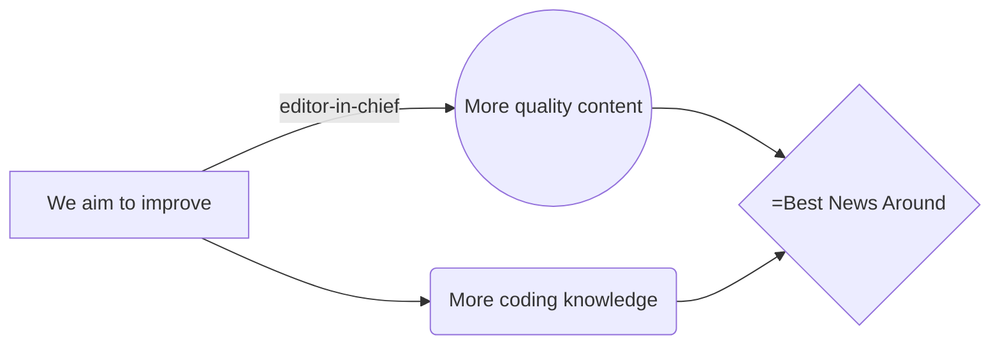

# LocalTechnews
LocalTechnews the webservice

## Acknowledgements

We would like to express our gratitude to everyone who has supported and inspired this project. Your feedback, ideas, and contributions have helped shape LocalTechnews into what it is today.

Special thanks to:
- Our community for continuous support and feedback.
- Our development team for their relentless work.
- All contributors who have shared their time and expertise.
## Authors

- [@Ilikesopsec](https://www.github.com/ilikeopsec)
- [@REDKING-11](https://www.github.com/redking-11)
## Features

- Comments
- Live previews
- Fullscreen mode
- Cross platform

## FAQ

#### can i ask questions

Yes

#### why is here no questions

because no one asks them

## Feedback

If you have any feedback, please reach out to us at LocalTechnews@proton.me

## License

[GPL-3.0](https://choosealicense.com/licenses/gpl-3.0/)

## Roadmap

- Additional browser support

- Add more integrations

|years plans     |                               |Payment plan  |
|----------------|-------------------------------|--------------|
|get a colleagues|`'editor-in-chief'`            |   0€         |
|                |`'content-writer'`             |   0€         |
|                |                               |   0€         |

