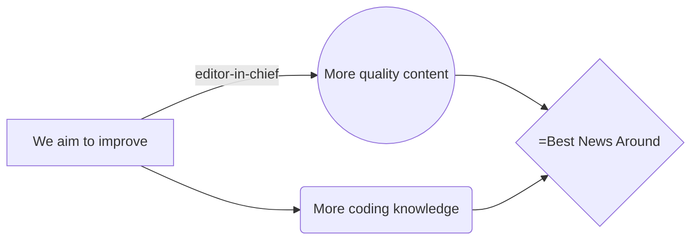

# LocalTechnews
LocalTechnews is a web service that brings you up-to-date tech news, allowing users to contribute articles, add comments, and participate in discussions. The platform is designed for tech enthusiasts, journalists, and developers who want to stay informed and share knowledge.

## Acknowledgements
We extend our deepest gratitude to everyone who has supported the LocalTechnews project. Your ideas, suggestions, and hard work have made this platform a reality. and your contributions have helped shape LocalTechnews into what it is today.

Special thanks to:
- Our community for continuous support and feedback.
- Our development team for their relentless work.
- All contributors who have shared their time and expertise.
## Authors

- [@Ilikesopsec](https://www.github.com/ilikeopsec)
- [@REDKING-11](https://www.github.com/redking-11)
## Features

- **Comments**: Engage in discussions by commenting on the latest articles and news.
- **Fullscreen Mode**: Focus on content without distractions.
- **Cross-Platform Compatibility**: Accessible from any browser we know of.

## FAQ

#### Can I ask questions?
Yes, feel free to reach out to us via email or our community forums.

#### Why are there no questions here?
This FAQ is new, but we plan to expand it as we receive more feedback and questions.

#### How do I contribute content?
You can sign up as a contributor, and after approval, you'll have access to the article creation tool.

## Feedback

If you have any feedback, please reach out to us at LocalTechnews@proton.me

## License

[GPL-3.0](https://choosealicense.com/licenses/gpl-3.0/)

## Roadmap

- Q4 2024: Add situational board to home screen to inform of some current situation like for example of (chat) being on or off
- Q4 2024: Add support for more browsers if there is any.
- Q1 2025: Introduce content suggestions and summaries.
- Q2 2025: Fix The Browser on Phone cutting the left side

## Vision Diagram

This diagram represents our goals for the future:

|years plans     |                               |Payment plan  |
|----------------|-------------------------------|--------------|
|get a colleagues|`'editor-in-chief'`            |   0€         |
|                |`'content-writer'`             |   0€         |
|                |                               |   0€         |

## Get Started

Ready to join LocalTechnews? [Send request](https://localtechnews.github.io) and we can start disgussing what would you like to add!

## Important note

Due to the absence of an editor-in-chief, most of our articles are generated with the assistance of AI. To maintain accuracy, a portion of the content—at least 10%—is independently verified for reliability.